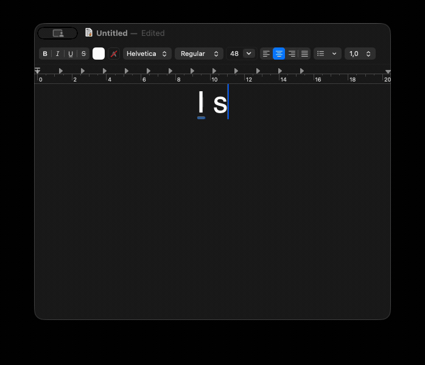

# reLayout

**Website:** [relayout.forfutdinov.com](https://relayout.forfutdinov.com/)



Punto/Caramba-style "retype the selection in the correct keyboard layout" for macOS — a
tiny menu-bar app. Select (or just type) wrong-layout text, hit the hotkey, and it's
retyped in the right layout; the system input source flips so you can keep going. Press the
hotkey again within ~1.5 s to undo.

Works with **any** enabled keyboard layouts — not hard-coded to a specific pair. An optional
**auto-correct** mode (default off) fixes wrong-layout words as you type, no hotkey needed.

## Install

```sh
brew install --cask vladforfutdinov/relayout/relayout
```

**Or** grab **`reLayout.dmg`** from the [latest release](https://github.com/vladforfutdinov/reLayout/releases/latest)
and drag **ReLayout** onto **Applications**. Releases are Developer-ID signed and **notarized**,
so they open without a Gatekeeper warning.

First launch asks for **Accessibility** (to read the selection / send keystrokes):
**System Settings → Privacy & Security → Accessibility** → enable **reLayout** → relaunch.

## Use

1. Select the mistyped text — or, with nothing selected, the caret line is grabbed and
   narrowed to just the wrong-layout tail you typed last.
2. Press the hotkey (default: **tap left Option**).
3. Press it again within ~1.5 s to **undo** (restores the text and the previous input source).

Conversion is **per word**: only words typed in the layout active when you press the hotkey are
converted; the rest is left alone. `я сказал ghbdtn` (US active) → `я сказал привет`.

Set your own hotkey (a combo, a modifier tap, or a tap sequence) and toggle auto-correct in
**rL → Settings…**.

## Why it handles `ß`/`æ` → `ы`/`э`

It doesn't map character→character. It maps `char → (source layout, reversed) → physical key + modifiers → (target layout) → char` via Carbon `UCKeyTranslate`, over the actually-installed
layouts. So the Option layer just works: `ы э ъ ё` (Option on Ukrainian) sit on the same
keycodes as `ß æ …` (Option on US), and convert with no hand-coded tables. Details in
[ARCHITECTURE.md](docs/ARCHITECTURE.md).

## Auto-correct (optional, default off)

A live mode that fixes a wrong-layout word **as you type**, no hotkey: on each word boundary a
per-language character-trigram model scores the word and silently corrects it when its converted
form is the plausible one. **Cross-script only** (ru/uk ↔ en), tuned for ≥99% precision, with a
per-app deny-list (*Settings → Auto-correct → Exceptions…*). Secure fields are always skipped.

## Privacy

Reading the selection and sending keystrokes needs Accessibility — the same grant a text
expander asks for. Everything below is verifiable in the source (MIT):

- **Your text never leaves the machine, and is never written to disk** — converted in memory,
  typed back. No analytics, telemetry, or account. The only network call is the
  [Sparkle](https://sparkle-project.org) update check (a signed appcast; off via Settings).
- **The clipboard is left untouched** on the Accessibility path; the rare ⌘C fallback only reads.
  So watchers like DeepL's `Ctrl+C+C` don't fire.
- **Password fields are skipped**, and only your settings are persisted — never text.

## Build from source

```sh
./scripts/make-cert.sh     # one-time: self-signed identity so the Accessibility grant survives rebuilds
./scripts/build.sh         # -> dist/ReLayout.app
./scripts/make-dmg.sh      # optional: -> dist/reLayout.dmg installer
open ./dist/ReLayout.app
```

Signed/notarized builds are produced by CI on a `vX.Y.Z` tag; forks can release under their own
identity. See [RELEASING.md](docs/RELEASING.md). Architecture and the Windows port live in
[ARCHITECTURE.md](docs/ARCHITECTURE.md).

Diagnostics:

```sh
./dist/ReLayout.app/Contents/MacOS/ReLayout --enabled    # list enabled sources in order
./dist/ReLayout.app/Contents/MacOS/ReLayout --selftest   # sample conversions, no GUI
```

## Limitations

- Same-script layouts (e.g. ABC vs German) can't be told apart per-word — every Latin word is
  treated as convertible.
- Secure input fields block synthetic keystrokes. Needs ≥ 2 enabled keyboard layouts.

## Credits

The UI is localized to 12 languages. Auto-correct trigram models in `Resources/trigram/` are
built offline from [FrequencyWords](https://github.com/hermitdave/FrequencyWords) by Hermit Dave
(MIT, derived from OpenSubtitles); reLayout ships only the derived statistics. Updates use
[Sparkle](https://sparkle-project.org).

## License

[MIT](LICENSE) © 2026 Volodymyr Forfutdinov.
